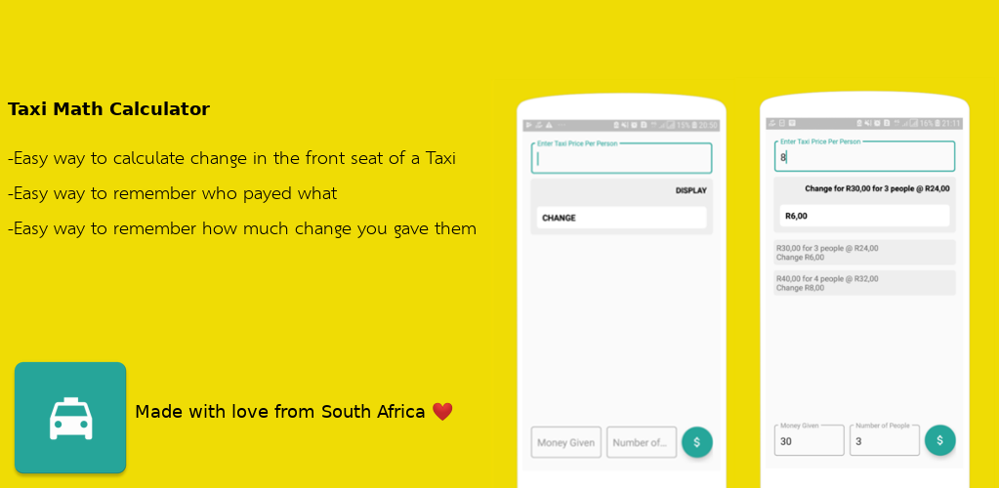

# TaxiMath

Taxi Math Calculator is an easy to use app that helps front seat passengers in South African taxis, who have to collect everyone else`s taxi fare, calculate and give them back their CORRECT change respectively.

The app also keeps history of all the change that has been calculated for a trip so that you the front seat passenger can know how much each back seat passenger gave you to avoid those common nasty arguments with the back passengers who claim to have received the wrong change or worse those who lie about the money they have sent to the front seat

# Thanks to:

https://www.appstorescreenshot.com/

Icons made by <a href="https://www.freepik.com/" title="Freepik">Freepik</a> from <a href="https://www.flaticon.com/" 			    title="Flaticon">www.flaticon.com</a> is licensed by <a href="http://creativecommons.org/licenses/by/3.0/" 			    title="Creative Commons BY 3.0" target="_blank">CC 3.0 BY</a>
